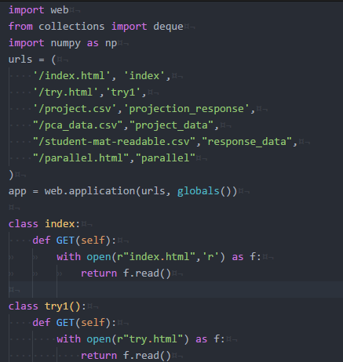

Final Project
===
Please find the proposal here:
[proposal](https://github.com/zc8340311/CS573FinalProject/blob/master/Proposal.pdf)

Please find the process here:
[process](https://github.com/zc8340311/CS573FinalProject/blob/master/Process\ book.pdf)

Flease find the 2mins demo video
[Demo video](https://www.youtube.com/watch?v=azVAb724OGY)

Quick View:
["Final Project"](https://zc8340311.github.io/CS573FinalProject/)

Note: The dimension reduction does not work on this link. To check all functions, please download it and run server.py  
===
Repo File Description:

1. Data are stored in data folder. 

2. server.py are server code. To test all functions of our final, please run this server using : python server.py

3. parallel_6.html is front end code. After server starts, please go to your web browser: http://localhost:8080/parallel_6.html .

4. *.pdf and *.tex are documents which list above.

===
Non-obvious Features:

We use web.py implement a server, which could listen on 8080 port (by default) and handle the url request. 

1.We first build a global variable map that map request url to its handler class.

2. Then implement the Get method in handler class. If dimension reduction data are required, the handler class will read the data from the server side and call dimension reduction methods in the scikit-learn package to return data.

A quick view of server code:

===
Reference:

[d3](https://d3js.org/)

[web.py](http://webpy.org/)

[scikit-learn](http://scikit-learn.org/stable/)
